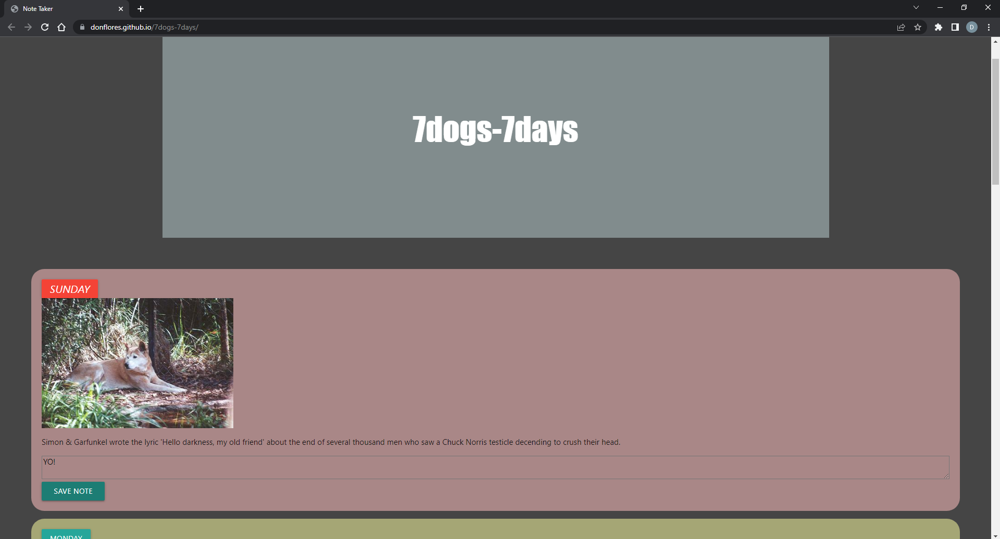

# 7dogs-7days

[Deployed Link Here](https://donflores.github.io/7dogs-7days/)

## Description

A website where you can take notes or keep track of your to do lists and see cute dogs and jokes.

## User Story

As a student I need a website to keep track of my daily assignments and look at dog pictures to keep my stress levels low.

## Framework

-Materialize

## Built With

- HTML
- CSS
- JavaScript

## API's

- Dog.ceo API
- Chuck Norris API

## Tasks

- Landing page
- When you click on each day of the week
- Then you will see a note space with a dog picture and a joke
- When you write notes
- Then you can save it on the local storage
- Then your note will be stored on a persistent data

## Collaborators

- [Don Flores](https://github.com/DonFlores)
- [Shayna Murphy](https://github.com/Shaynam1977)
- [Ramin Noorzada](https://github.com/RaminNoorzada)
- [Jingmey Sherpa](https://github.com/jsherpss)

## Screenshot of the page

The following image shows the websites current state.

